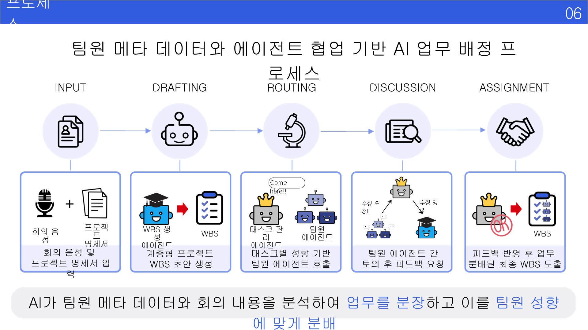
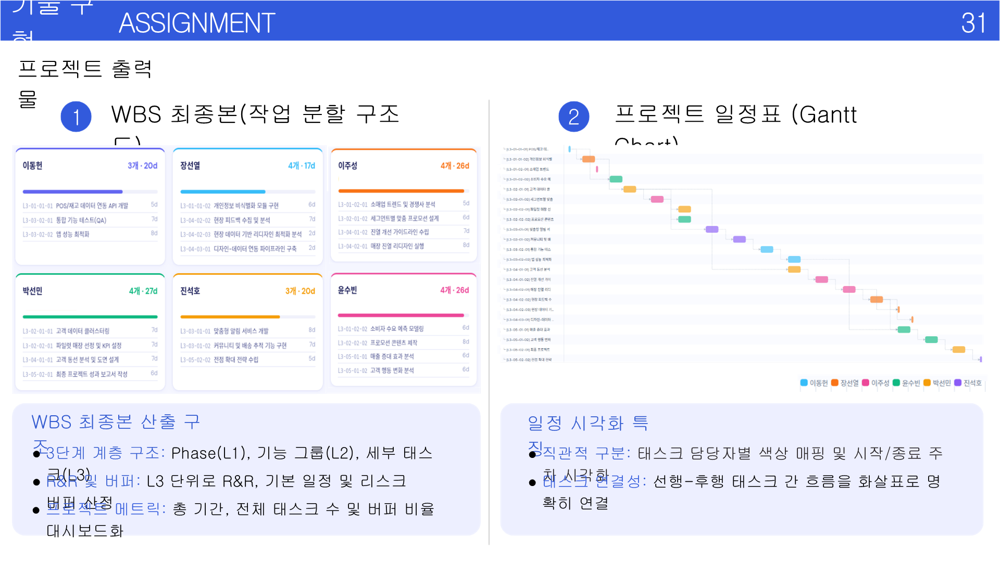
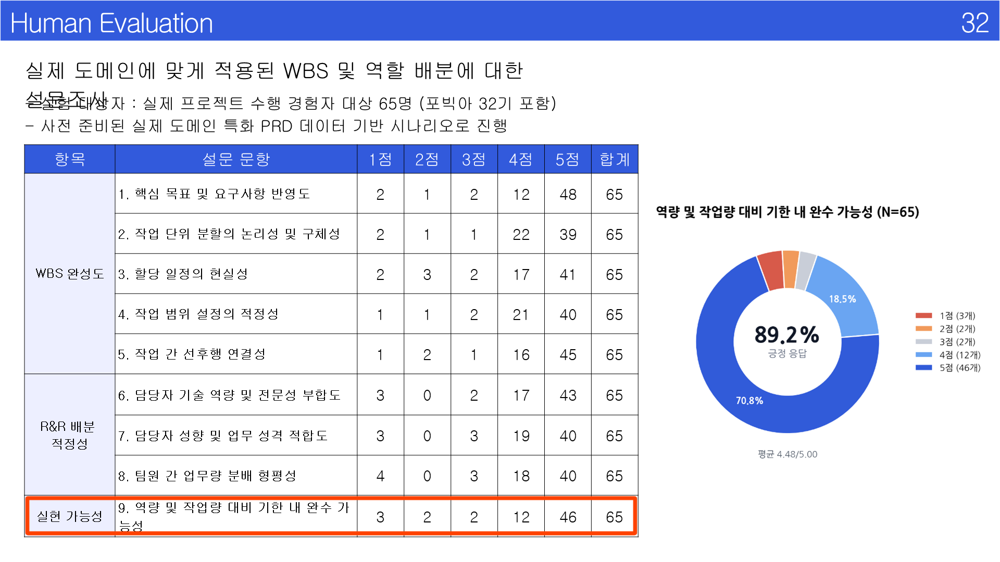

<div align="center">

# symPO

### 멀티에이전트 기반 지능형 업무 분장 · WBS 생성 시스템

*PRD·팀 컨텍스트·회의록을 넣으면, 토론을 거친 역할·일정·버퍼가 포함된 WBS가 나옵니다.*

<br/>

[](https://www.python.org/)
[](https://github.com/langchain-ai/langgraph)
[](LICENSE)

**[English README](README.md)**

<br/>

[개요](#개요) · [파이프라인](#파이프라인) · [산출물](#산출물) · [검증](#검증) · [기술 스택](#기술-스택) · [실행](#빠른-실행)

</div>

---

## 개요

**symPO**는 *symposium(토론) + project orchestration(프로젝트 조율)*의 줄임입니다. 핵심 질문은 하나입니다.

> *실제 기획 입력만으로, LLM 에이전트 팀이 **한 번에 찍어낸 초안**이 아니라 **쓸 만한 WBS**를 만들 수 있는가?*

단일 프롬프트 대신 **5단계 파이프라인**을 돌립니다. 문맥 수집 → 구조 초안 → 전문가 라우팅 → 토론·수정 → 최종 배정. PM 역할 슈퍼바이저가 버퍼·재배정·합의를 중재합니다.

| 입력 | 출력 |
|------|------|
| 제품 요구사항(PRD) | 3단계 WBS (단계 → 기능군 → 세부 태스크) |
| 팀원 스킬·이력 | 리프 태스크별 R&R |
| 회의록 (선택) | 계획이 어떻게 바뀌었는지 토론 기록 |
| 성향 프로필 (선택, 실험용) | 자동·인간 평가 점수 |

이 레포에는 **오케스트레이션 코드**, **UI·API·MCP**, **평가 하네스**(ablation + **65명 인간 설문**)가 함께 들어 있습니다.

---

## 파이프라인

<p align="center">
  
</p>

| 단계 | 내용 |
|:----:|------|
| **Input** | 회의 음성·명세서·팀 메타데이터를 파싱하고 검색용으로 인덱싱합니다. |
| **Drafting** | 생성 에이전트가 계층형 WBS 초안을 만듭니다. |
| **Routing** | 태스크 매니저가 스킬에 맞는 팀원 에이전트를 호출합니다. |
| **Discussion** | 리스크·버퍼·인수인계를 검토하고, 필요 시 슈퍼바이저가 중재합니다. |
| **Assignment** | 피드백을 반영해 일정과 담당을 확정합니다. |

동일 엔진이 **웹 UI**, **실시간 스트리밍 API**, **MCP 서버**에서 돌아갑니다.

---

## 산출물

<p align="center">
  
</p>

- **구조화된 WBS** — L1 / L2 / L3, 공수·리스크 버퍼 포함  
- **팀원별 태스크 카드** — 담당 업무와 기간  
- **일정 뷰** — 선후행 관계가 보이는 간트형 타임라인  
- **토론 로그** — 에이전트 reasoning과 PM 결정의 감사 추적  

---

## 검증

데모에서 멈추지 않았습니다. 백본 비교, RAG ablation, 컨텍스트 메타데이터 실험, 현업 실무자 대상 설문을 포함합니다.

<p align="center">
  
</p>

| 신호 | 요약 |
|------|------|
| 다라운드 토론 | 대부분 모델에서 생성만 할 때보다 Judge 점수 개선 |
| 백본 안정성 | 본 조건에서 Gemma-26B MoE가 가장 일관적 |
| 이력서 vs 성향 | 파일럿에서 eDISC 단독보다 스킬·경력 메타데이터가 배정에 유리 |
| 인간 설문 (N=65) | 평균 **4.48 / 5.00**, 마감 실현 가능성 **89.2%** 긍정 |

상세 보고서 → [`experiments/eval_results/EXPERIMENTS_SUMMARY.md`](experiments/eval_results/EXPERIMENTS_SUMMARY.md)

---

## 기술 스택

| 영역 | 기술 |
|------|------|
| 코어 | Python 3.10+, LangChain, LangGraph |
| 인터페이스 | Streamlit · FastAPI(SSE) · MCP(FastMCP) |
| 검색 | FAISS, sentence-transformers; hybrid/graph/agentic RAG 실험 |
| 모델 | Gemini, OpenAI, Anthropic, 로컬·Ollama; mock 오프라인 모드 |
| 평가 | AutoScore v2 · G-Eval 스타일 LLM Judge · 교차 심사 |

---

## 빠른 실행

```bash
python -m venv .venv && source .venv/bin/activate   # Windows: .venv\Scripts\activate
pip install -r requirements.txt
cp .env.example .env
```

기본값은 **mock LLM**이라 API 키 없이 흐름을 볼 수 있습니다.

```bash
cd src
streamlit run main.py                 # UI
uvicorn api:app --reload              # API + 스트림
python mcp_server.py                    # MCP
```

평가 하네스 스모크 테스트:

```bash
cd src && python ../experiments/eval/experiment_runner.py --backend mock --runs 1
```

---

## 작성자

**Sukoji** — 상명대 휴먼엔지니어디자인 AI전공 · [POSTECH PIAI](https://piai.postech.ac.kr/english) 연구

---

<div align="center">
<sub>캡스톤 / 에이전트 시스템 연구 · 2026 · 포스코 청년 AI·BigData 아카데미 32기 팀 프로젝트</sub>
</div>
