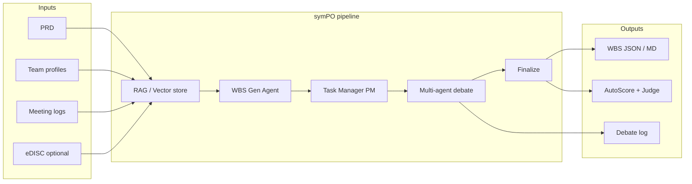
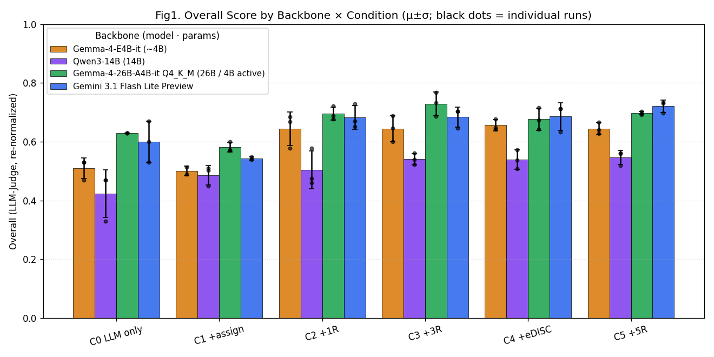
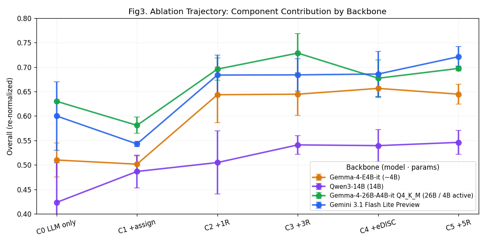
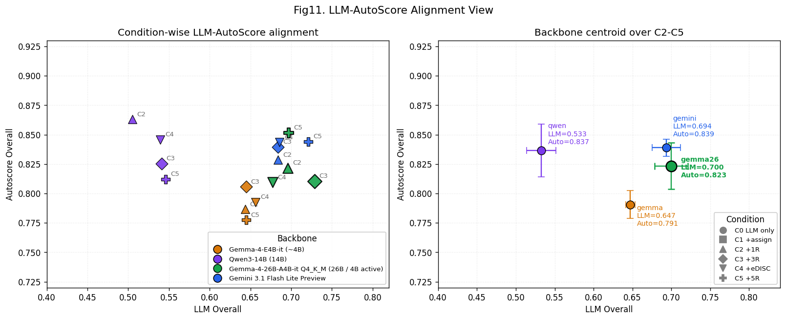
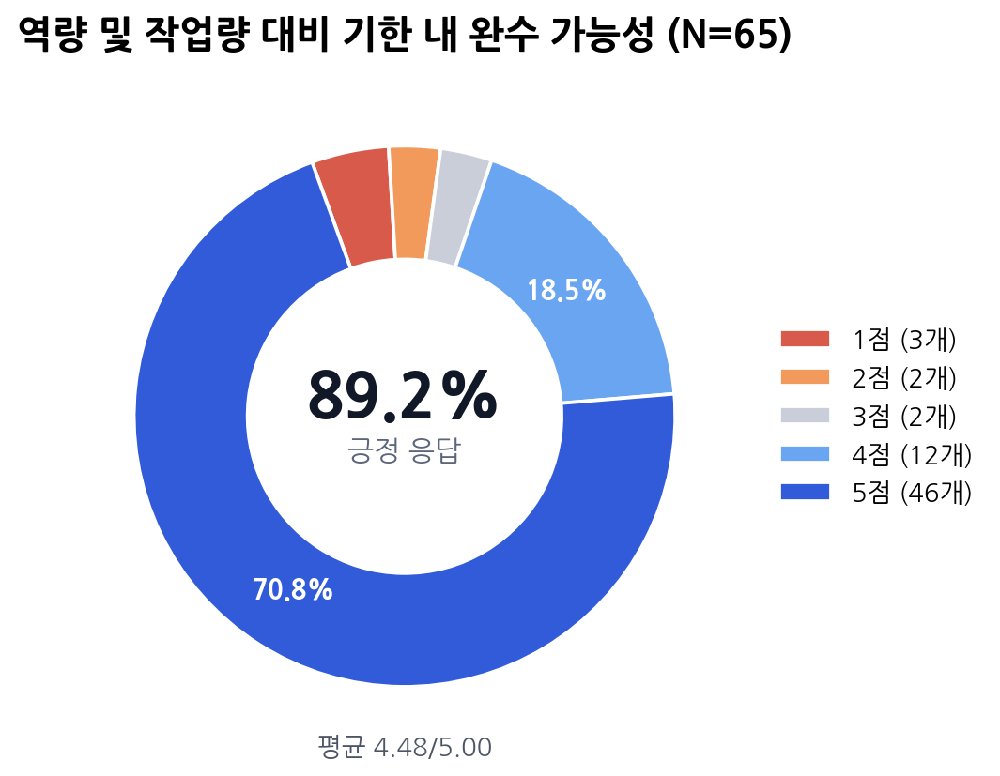

<div align="center">

# symPO

**Multi-agent orchestration for PRD → WBS generation**

PRD, team profiles, meeting logs, and optional eDISC behavioral metadata in —  
a debated, assignable 3-level WBS out.

[](https://www.python.org/)
[](https://github.com/langchain-ai/langgraph)
[](LICENSE)

[Architecture](#architecture) · [Results](#key-findings) · [Quick start](#quick-start) · [Experiments](#experiments)

</div>

---

## Overview

**symPO** (*symposium + project orchestration*) is a research-grade portfolio project that turns product inputs into a **Work Breakdown Structure (WBS)** through **multi-agent debate**, not one-shot LLM generation.

The system ingests:

- **PRD** — goals, scope, features, constraints  
- **Team resumes** — skills, experience, strengths / weaknesses  
- **Meeting transcripts** — schedule lessons and risk signals  
- **eDISC profiles** (optional) — behavioral metadata for assignment experiments  

It produces:

- Hierarchical **L1 / L2 / L3 WBS** with buffers and R&R assignments  
- A full **debate log** and **MCP-style tool trace** per orchestration phase  
- **AutoScore** metrics + optional **LLM-as-Judge** (Structure / Assignment / Debate)

Built as a **capstone-style agent systems lab**: LangGraph DAG, RAG strategy ablations, backbone comparisons, and a human evaluation study (N=65).

---

## Architecture



| Phase | Role | MCP boundary |
|------:|------|----------------|
| 1 | WBS draft / revision | `wbs-server.generate_draft` |
| 2 | L3 assignment & candidate pools | `assignment-server.match_tasks` |
| 3 | L2 candidate review | `debate-server.candidate_review` |
| 4 | Free discussion (PASS-token early exit) | `debate-server.free_discussion` |
| 5 | Optional critic cross-review | `debate-server.role_review` |
| 6 | PM mediation & buffer / reassignment | `supervisor-server.mediate` |
| 7 | Final WBS lock-in | `supervisor-server.finalize` |

Runtime entry points:

| Surface | Path |
|---------|------|
| Streamlit UI | `src/main.py` |
| FastAPI + SSE | `src/api.py` |
| MCP tools | `src/mcp_server.py` |
| Experiment runner | `experiments/eval/experiment_runner.py` |

---

## Key findings

> From 4-backbone ablation, model-swap, RAG, context-metadata, and human evaluation runs.  
> Full write-ups: [`experiments/eval_results/EXPERIMENTS_SUMMARY.md`](experiments/eval_results/EXPERIMENTS_SUMMARY.md)

| Claim | Evidence |
|-------|----------|
| Multi-agent debate improves quality vs. generate-only | C1→C2/C3 Judge overall up on Gemma26, Gemini, Gemma (e.g. Gemma26: 0.58 → 0.73 at C3) |
| Gemma4-26B MoE was the most stable backbone in-project | Top C3 overall; model-swap did not always beat the unified backbone |
| Resume / skill metadata beat eDISC alone for assignment | Context-metadata ablation: M_resume 0.619 vs M_disc 0.566 |
| Human raters were positive on outputs | N=65, 9 items, mean **4.48 / 5.00**, 91.6% positive (4–5) |

<p align="center">
  
  
</p>

<p align="center">
  
  
</p>

---

## Repository layout

```text
sympo/
├── src/                    # Application code (agents, orchestration, UI, MCP)
├── experiments/
│   ├── eval/               # Reusable runners, judge, analyzers
│   └── eval_results/       # Reports, figures, summaries (no raw snapshot dumps)
├── sample_data/            # Demo PRD, members, meetings, eDISC PDFs
├── docs/
│   ├── assets/             # README figures
│   └── project_docs/       # Deep-dive references
└── requirements.txt
```

Excluded from git (see [`.gitignore`](.gitignore)): secrets, LoRA checkpoints, presentation source PPTX, legacy `ref/` tree, raw `wbs_snapshot_*.json` dumps, survey CSV.

---

## Quick start

```bash
python -m venv .venv
# Windows: .venv\Scripts\activate
# macOS/Linux: source .venv/bin/activate

pip install -r requirements.txt
cp .env.example .env
```

Default `LLM_BACKEND=mock` runs **without API keys** for pipeline smoke tests.

```bash
# Streamlit UI
cd src && streamlit run main.py

# FastAPI + SSE
cd src && uvicorn api:app --host 0.0.0.0 --port 8000 --reload

# MCP server
cd src && python mcp_server.py
```

### Minimal experiment (mock)

```bash
cd src
python ../experiments/eval/experiment_runner.py --backend mock --conditions C0_llm_only C3_3rounds --runs 1
```

With a real backend (e.g. Gemini):

```bash
# set GOOGLE_API_KEY in .env
python ../experiments/eval/experiment_runner.py --backend gemini --conditions C3_3rounds --runs 3
```

---

## Experiments

| Study | Report |
|-------|--------|
| 4-backbone ablation (Gemma / Qwen / Gemma26 / Gemini) | [`comparison_4backbones/COMPARISON_REPORT.md`](experiments/eval_results/comparison_4backbones/COMPARISON_REPORT.md) |
| Model swap (WBS Gen / Task Manager) | [`model_swap_experiment/.../SUMMARY.md`](experiments/eval_results/model_swap_experiment/wbs_taskmgr_model_comparison_20260426/SUMMARY.md) |
| RAG strategies | [`rag_strategy_comparison/conclusion.md`](experiments/eval_results/rag_strategy_comparison/conclusion.md) |
| Context metadata (resume vs eDISC) | [`context_metadata_experiment/CONTEXT_METADATA_REPORT.md`](experiments/eval_results/context_metadata_experiment/CONTEXT_METADATA_REPORT.md) |
| Evaluation framework | [`EVALUATION_FRAMEWORK.md`](experiments/eval_results/EVALUATION_FRAMEWORK.md) |

**AutoScore v2** weights: Quality 45% · Allocation 35% · Orchestration 20%.  
**Judge overall**: Structure 40% · Assignment 35% · Debate 25%.

---

## Tech stack

Python · LangChain / LangGraph · Streamlit · FastAPI · FAISS + sentence-transformers · MCP (FastMCP) · optional LangSmith tracing

---

## Author

**Sukoji** — Human-Centered AI Engineering @ Sangmyung Univ. · Research @ [POSTECH Institute for AI (PIAI)](https://piai.postech.ac.kr/english)

Portfolio context: multi-agent orchestration, eval harnesses, and tool-boundary design for production-minded LLM systems.

---

<div align="center">
  <sub>Capstone / research codebase — 2026</sub>
</div>
