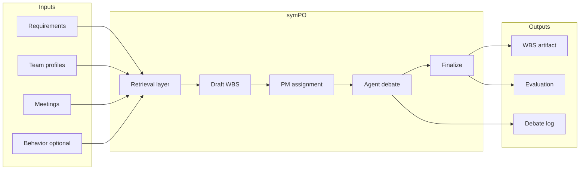

<div align="center">

# symPO

**Multi-agent WBS orchestration from product & team context**  
**제품·팀 컨텍스트 기반 멀티에이전트 WBS 오케스트레이션**

[](https://www.python.org/)
[](https://github.com/langchain-ai/langgraph)
[](LICENSE)

[English](#english) · [한국어](#korean)

</div>

---

<a id="english"></a>

## English

### What is this?

**symPO** (*symposium + project orchestration*) is a **research portfolio project** that asks a practical question:

> Can a team of LLM agents—guided by real project inputs—produce a **workable WBS** with **roles, schedules, and buffers**, instead of a one-shot draft that looks fine but falls apart in planning?

It is built like a **small agent-systems lab**: orchestration, retrieval, debate, PM mediation, and a full **evaluation stack** (automatic metrics, LLM judges, human study).

**Inputs**

| Input | Role |
|-------|------|
| Product requirements (PRD) | Scope, features, constraints |
| Team resumes / profiles | Skills, experience, strengths & gaps |
| Meeting notes | Schedule lessons, risks, prior decisions |
| Behavioral profiles (optional) | eDISC-based metadata for assignment experiments |

**Outputs**

| Output | Role |
|--------|------|
| 3-level WBS (L1 → L2 → L3) | Hierarchy, estimates, buffers |
| Role & responsibility map | Who owns which leaf tasks |
| Debate transcript | How agents disagreed and converged |
| Quality report | AutoScore + optional judge scores |

---

### How it works (at a glance)



1. **Retrieve** — Pull relevant PRD, member, meeting, and reference context (multiple RAG strategies tested in experiments).
2. **Draft** — A dedicated generator builds an initial 3-level WBS.
3. **Assign** — A PM-style supervisor maps people to tasks using skills and context (not by leaking ground-truth roles into prompts).
4. **Debate** — Role-shaped agents review by work package: risks, buffers, hand-offs, reassignment requests.
5. **Mediate & finalize** — The supervisor merges feedback, adjusts schedules, and locks the final plan.

The same pipeline runs behind a **browser UI**, a **streaming API**, and an **MCP tool server** for external agent clients.

---

### Tech stack

| Layer | Choices |
|-------|---------|
| Language | Python 3.10+ |
| Agents & orchestration | LangChain, LangGraph (graph + sequential fallback) |
| Interfaces | Streamlit UI · FastAPI with SSE · MCP (FastMCP) |
| Retrieval | FAISS + sentence-transformers; hybrid / graph / agentic RAG variants |
| Models | Pluggable backends (Gemini, OpenAI, Anthropic, local/Ollama, mock for offline runs) |
| Evaluation | Custom AutoScore v2 · G-Eval-style LLM judge · cross-model judging · human survey (N=65) |
| Observability | Optional LangSmith tracing |

---

### What we measured

Capstone-scale studies—not a single demo run:

| Theme | Question |
|-------|----------|
| Debate value | Does multi-round discussion beat generate-only or assign-only? |
| Backbone comparison | Gemma, Qwen, Gemma-26B MoE, Gemini under identical conditions |
| RAG design | Vanilla vs hybrid vs graph vs agentic retrieval |
| Context signals | Resume/skills vs behavioral (eDISC) metadata for assignment |
| Human trust | 65 raters × 9 Likert items on WBS quality, R&R fit, feasibility |

**Headline results**

| Finding | Summary |
|---------|---------|
| Debate helps | Extra discussion rounds improved judge scores on most backbones (largest gains on Gemma-26B / Gemini-class models) |
| Stable backbone | Gemma-26B MoE was the most consistent overall in this setup; per-role model swaps did not always win |
| Skills > DISC alone | Resume/skill context outperformed eDISC-only for assignment in the pilot ablation |
| Humans agreed | Survey mean **4.48 / 5.00**, **91.6%** positive (4–5) across 585 responses |

<p align="center">
  
  
</p>

<p align="center">
  
  
</p>

Detailed reports live under the experiments results folder. Start with the [experiments summary](experiments/eval_results/EXPERIMENTS_SUMMARY.md) and [evaluation framework](experiments/eval_results/EVALUATION_FRAMEWORK.md).

---

### Try it locally

```bash
python -m venv .venv && source .venv/bin/activate   # Windows: .venv\Scripts\activate
pip install -r requirements.txt
cp .env.example .env
```

Default config uses a **mock LLM**—no API key required for a dry run.

```bash
cd src
streamlit run main.py          # interactive UI
uvicorn api:app --reload       # HTTP + live stream API
python mcp_server.py           # MCP tool server
```

Run a tiny offline experiment:

```bash
cd src
python ../experiments/eval/experiment_runner.py --backend mock --runs 1
```

Set `GOOGLE_API_KEY` (or another provider in `.env`) to reproduce real-model runs.

---

### Repository shape (conceptual)

| Area | Contents |
|------|----------|
| Application core | Agents, orchestration, metrics, UI, API, MCP |
| Experiments | Runners, judges, analysis scripts |
| Results & figures | Reports, charts, aggregated CSVs (raw snapshot dumps excluded) |
| Sample data | Demo PRD, fictional team, meetings, eDISC PDFs |

Secrets, model checkpoints, presentation sources, and large raw JSON dumps are **not** in the repo—see `.gitignore`.

---

### Author

**Sukoji** — Human-Centered AI Engineering @ Sangmyung Univ. · Research @ [PIAI, POSTECH](https://piai.postech.ac.kr/english)

Focus: multi-agent orchestration, evaluation harnesses, and tool boundaries that stay understandable in production.

---

<a id="korean"></a>

## 한국어

### 이 프로젝트는?

**symPO**는 *symposium(토론) + project orchestration(프로젝트 조율)*의 줄임으로, 한 문장으로 말하면 이렇습니다.

> **PRD·팀원·회의록** 같은 실제 기획 입력을 바탕으로, LLM 에이전트 팀이 **토론·중재**를 거쳐 **실무에 가까운 WBS**(역할·일정·버퍼 포함)를 만드는가?

단발성 생성이 아니라 **에이전트 시스템 연구/포트폴리오**에 가깝게 설계했습니다. 오케스트레이션, RAG, 토론 루프, PM 중재, 그리고 **자동 지표 + LLM 심사 + 인간 평가**까지 한 세트로 묶여 있습니다.

**넣는 것**

| 입력 | 역할 |
|------|------|
| PRD | 목표, 범위, 기능, 제약 |
| 팀원 이력·프로필 | 기술 스택, 경력, 강점·약점 |
| 회의록 | 일정 교훈, 리스크, 합의 사항 |
| eDISC 등 성향 정보 (선택) | 배정 실험용 보조 메타데이터 |

**나오는 것**

| 산출물 | 역할 |
|--------|------|
| 3단계 WBS (L1→L2→L3) | 계층·공수·버퍼 |
| R&R 배정 | 리프 태스크 담당 |
| 토론 로그 | 에이전트 간 합의 과정 |
| 품질 리포트 | AutoScore + (선택) LLM Judge 점수 |

---

### 동작 흐름 (한눈에)

위 **English** 섹션의 다이어그램과 동일합니다. 단계만 한국어로 정리하면:

1. **검색** — PRD·팀원·회의·참고 WBS에서 관련 문맥을 가져옵니다 (실험에서 RAG 전략 여러 종을 비교).
2. **초안** — WBS 생성 에이전트가 3단계 구조 초안을 만듭니다.
3. **배정** — PM 역할 슈퍼바이저가 스킬·문맥 기반으로 담당자를 매칭합니다 (정답 역할을 프롬프트에 노출하지 않도록 설계).
4. **토론** — 역할별 에이전트가 작업 묶음 단위로 리스크·버퍼·재배정을 논의합니다.
5. **중재·확정** — 슈퍼바이저가 피드백을 반영하고 최종 WBS를 확정합니다.

**웹 UI**, **실시간 스트리밍 API**, **MCP 도구 서버**가 같은 파이프라인을 공유합니다.

---

### 기술 스택

| 구분 | 사용 기술 |
|------|-----------|
| 언어 | Python 3.10+ |
| 에이전트·오케스트레이션 | LangChain, LangGraph (그래프 실행 + 순차 폴백) |
| 인터페이스 | Streamlit · FastAPI(SSE) · MCP(FastMCP) |
| 검색(RAG) | FAISS + sentence-transformers, hybrid/graph/agentic 등 전략 실험 |
| LLM | Gemini / OpenAI / Anthropic / 로컬·Ollama / mock(오프라인) |
| 평가 | AutoScore v2 · G-Eval 스타일 LLM Judge · 교차 심사 · 인간 설문(N=65) |
| 추적 | LangSmith (선택) |

---

### 실험에서 본 것

졸업/캡스톤 수준의 **체계적 실험**입니다.

| 주제 | 질문 |
|------|------|
| 토론 효과 | 생성만 / 배정만 vs 다라운드 토론 |
| 백본 비교 | Gemma, Qwen, Gemma-26B MoE, Gemini 동일 조건 |
| RAG 설계 | vanilla · hybrid · graph · agentic |
| 컨텍스트 신호 | 이력서·스킬 vs eDISC 단독/추가 |
| 인간 신뢰 | 65명·9문항 설문 |

**핵심 결과 요약**

| 발견 | 요약 |
|------|------|
| 토론의 이점 | 대부분 백본에서 토론 라운드 추가 시 Judge 점수 개선 (Gemma-26B·Gemini 계열에서 폭 큼) |
| 안정적 백본 | 본 조건에서 Gemma-26B MoE가 전반적으로 가장 안정적; 역할별 소형 모델 교체가 항상 이기지는 않음 |
| 스킬 정보 우세 | 파일럿에서 eDISC 단독보다 이력서·스킬 기반 메타데이터가 배정에 유리 |
| 인간 평가 긍정 | 평균 **4.48 / 5.00**, **91.6%** 긍정(4~5점) |

<p align="center">
  
  
</p>

<p align="center">
  
  
</p>

상세 보고서는 실험 결과 폴더에 있습니다. [실험 통합 요약](experiments/eval_results/EXPERIMENTS_SUMMARY.md), [평가 프레임워크](experiments/eval_results/EVALUATION_FRAMEWORK.md)부터 보시면 됩니다.

---

### 로컬 실행

```bash
python -m venv .venv && source .venv/bin/activate   # Windows: .venv\Scripts\activate
pip install -r requirements.txt
cp .env.example .env
```

기본값은 **mock LLM**이라 API 키 없이도 흐름을 확인할 수 있습니다.

```bash
cd src
streamlit run main.py          # UI
uvicorn api:app --reload       # API + 실시간 스트림
python mcp_server.py           # MCP 서버
```

오프라인 미니 실험:

```bash
cd src
python ../experiments/eval/experiment_runner.py --backend mock --runs 1
```

실제 모델 재현은 `.env`에 해당 제공자 API 키를 설정하세요.

---

### 레포 구성 (개념)

| 영역 | 내용 |
|------|------|
| 애플리케이션 | 에이전트, 오케스트레이션, 지표, UI, API, MCP |
| 실험 코드 | 러너, Judge, 분석 스크립트 |
| 결과·차트 | 보고서, figure, 요약 CSV (대용량 스냅샷 JSON은 제외) |
| 샘플 데이터 | 데모 PRD, 가상 팀원, 회의록, eDISC PDF |

시크릿, 학습 체크포인트, 발표 원본, 대용량 raw 덤프는 포함하지 않습니다 (`.gitignore` 참고).

---

### 작성자

**Sukoji** — 상명대 휴먼엔지니어디자인 AI전공 · [POSTECH PIAI](https://piai.postech.ac.kr/english) 연구

관심 분야: 멀티에이전트 오케스트레이션, 평가 하네스, 프로덕션에서도 읽히는 tool boundary 설계.

---

<div align="center">
  <sub>Capstone / research codebase · 2026</sub>
</div>
